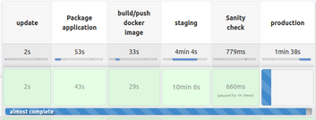
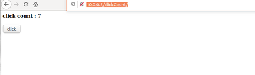

# Click Count application

## Getting Started 

This project shows a simple java application with a CI/CD pipeline using jenkins and the provisining and the creation of local VMs using Vagrant and docker to containerize our application

### Prerquisites

install jenkins 

 https://www.jenkins.io/doc/book/installing/

install vagrant

 https://www.vagrantup.com/docs/installation
 
 
 ### Setup Jenkins pipeline 
 
 After the installation of jenkins, we have to setup our pipeline and link it with our github repository
 
 For more details : 
 
  https://www.jenkins.io/doc/pipeline/tour/hello-world/
  
 ###  Provision our VMs using Vagrant
 
 We have choosed Vagrant as a tool to create our servers  and to launch them  you can use : 
 
      cd  click-count
      Vagrant up 
      
Note:  You may have to reload the VMs after their creation so they can take in consideration the installed packages

      Vagrant reload 
      
      
###  CI/CD Pipeline 

with every commit on the repository, the pipeline is launched  to update our environment 

###   Application

we have 2 environments (staging,production)   and to access : 

Staging :    http://10.0.0.4/clickCount/   
Production : http://10.0.0.5/clickCount/   

